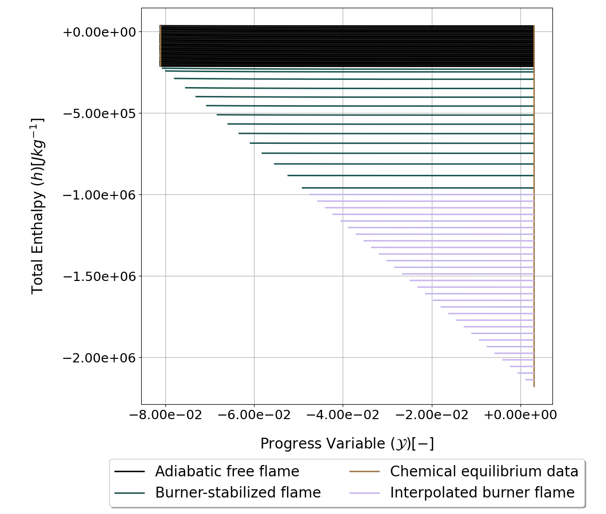
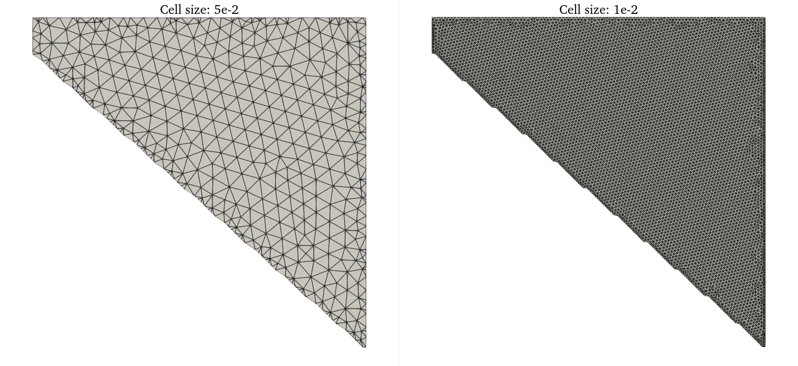
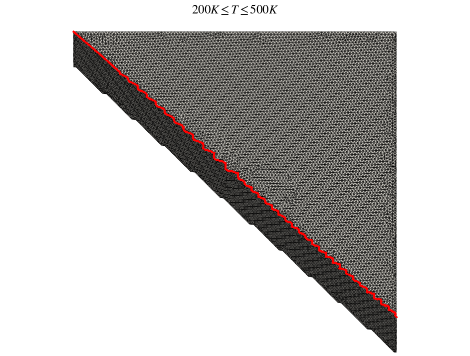
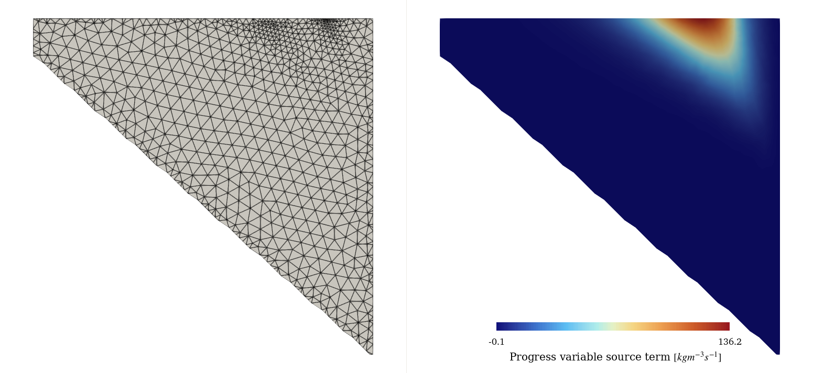
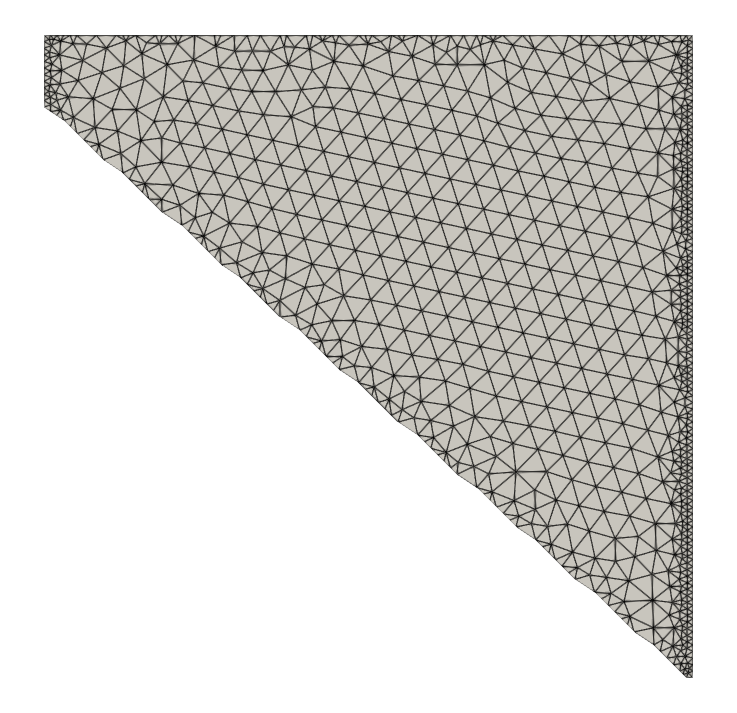
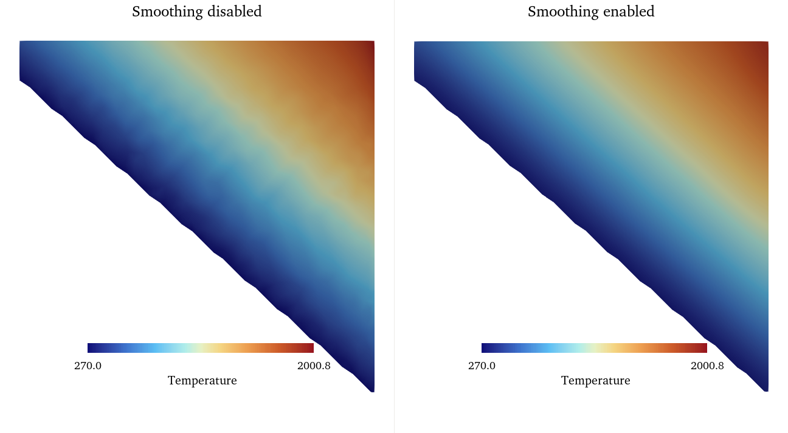

.. sectionauthor:: Evert Bunschoten

.. _tutorial_methane_tabulation:

Table-Based Flamelet-Generated Manifold for Methane Combustion
==============================================================

This tutorial explains how to use *SU2 DataMiner* to generate a two-dimensional look-up table for methane FGM simulations in SU2. Documentation on the table generator class can be found :ref:`here <doc_fgm_tabulation>`.
The goal of the tutorial is to give the user some familiarity with the main steps involved with generating FGM tables for applications with two controlling variables.
The steps of the tutorial are explained on this page with the use of code snippets and images. The python files for this tutorial can be found under **Tutorials->FGM->01_methane_tabulation**.

.. important::

    This tutorial was written and tested on a Linux operating system. If you want to run it on Windows, make sure you replace the file path separator in the python files!

.. contents:: :depth: 2

Set-up 
------

To run this tutorial, you only need a working installation of *SU2 DataMiner*. Consult the :ref:`installation instructions<label_setup>` for details.

Step 1: Generate Configuration
------------------------------

As with any application in *SU2 DataMiner*, the process starts with generating a **configuration**. 
For this tutorial, the goal is to generate a look-up table from which thermochemical state information can be retrieved from premixed methane flamelets at an **equivalence ratio of 0.7**.
The controlling variables are the **progress variable** and the **total enthalpy** to account for the effects of heat loss on combustion.

The flamelet types included in the manifold are **adiabatic free flames**, **burner-stabilized flamelets**, **chemical equilibrium data**, and **interpolated thermochemistry data**. 

As the application is methane combustion, the effects of preferential diffusion are negligible. Therefore, the **unity Lewis number** assumption is applied to speed up flamelet calculations.

The code snippet below shows how to set up the configuration for this tutorial. The file can also be found under **Tutorials->FGM->01_methane_tabulation->01_generate_config.py**.

.. code-block::

    #!/usr/bin/env python3
    from su2dataminer.config import Config_FGM 

    config = Config_FGM()
    config.SetReactionMechanism("gri30.yaml")
    config.SetTransportModel("unity-Lewis-number")
    config.SetFuelDefinition(["CH4"],[1])
    config.setFlameletTypes(["FREEFLAME","BURNERFLAME","EQUILIBRIUM","INT_BURNERFLAME"])
    config.SetMixtureBounds(0.7,0.7)
    config.SetUnbTempBounds(270, 500)
    config.SetNpTemp(30)
    config.SetMdotDHTarget(5e4)
    config.SetNpMdotExtra(30)
    config.SetControllingVariables(["ProgressVariable","EnthalpyTot"])
    config.SetPassiveSpecies(["CO","CO2"])
    config.SetConfigName("methane_tabulation")
    config.SaveConfig()

Step 2: Generate Flamelet Data 
------------------------------

The flamelet data are generated by running the command

.. code-block::
    
    >>> GenerateFluidData.py --c methane_tabulation.cfg --np 1 

in the terminal. The flamelet data files will be saved in the local folder and each flamelet type is saved in a separate folder.
First the adiabatic flamelets are generated, followed by the burner-stabilized flamelets, the chemical equilibrium data, and finally, the interpolated thermochemistry.

After the process is complete, the flamelet solutions can be visualized with the following command 

.. code-block::

    >>> PlotFlamelets.py --c methane_tabulation.cfg --m

which prompts the user to select the flamelet files from each type to be visualized. The figure below shows the trends of the total enthalpy and progress variable of the flamelets generated in this tutorial.

   Total enthalpy and progress variable of the flamelets generated in the tutorial.

Step 3: Accumulation of Flamelet Data 
-------------------------------------

The table is generated from the point cloud of flamelet data generated in the previous step. Here, the flamelet data are projected onto the progress variable - total enthalpy space and is homogenized in order to minimize observational biases in the data set. 

The following code snippet shows the commands needed to generate the point cloud data files. The source code of this file can also be found at **Tutorials->FGM->01_methane_tabulation->02_accumulate_flamelets.py**.

.. code-block::

    #!/usr/bin/env python3
    from su2dataminer.config import Config_FGM 
    from su2dataminer.process_data import FlameletConcatenator

    config = Config_FGM("methane_tabulation.cfg")

    FC = FlameletConcatenator(config)
    FC.IgnoreMixtureBounds(True)
    FC.ConcatenateFlameletData()

After running the code snippet above, there will be four csv files written to the current working directory with the header **fluid_data**. The data in these files will be interpolated onto the nodes of the table data in the next step.

Step 4: Generate Look-Up Table 
------------------------------

The final step in this tutorial is the generation of the look-up table. The first step is to load the FGM table generator and initialize it using the settings saved in the *SU2 DataMiner* configuration.

.. code-block::

    from su2dataminer.config import Config_FGM 
    from su2dataminer.manifold import SU2TableGenerator_FGM

    config = Config_FGM("methane_tabulation.cfg")

    lut = SU2TableGenerator_FGM(config)
    lut.setVerbosity(2)

Adjusting the verbosity level changes the amount of information displayed in the terminal during the table generation process. Minimal information is written with the default level 0, while the maximum verbosity level is 4.
Optionally, you can define the parameters of the interpolator function used to interpolate the thermochemistry data from the flamelets onto the table nodes, as shown in the code snippet below. If you don't define these parameters, the table generator will search for the optimum set of parameters automatically.
More information on the interpolation algorithm used in all tabulated methods in *SU2 DataMiner* can be found :ref:`here<doc_tablegeneration_base>`.

.. code-block::

    # Parameters for interpolator
    lut.setNNearestNeighbors(12)
    lut.setInverseDistanceExponent(2)

The next step is to define the refinement criteria for the table. The maximum cell size can be manually specified with 

.. code-block::

    lut.setMaximumCellSize(1e-2)

Or can be defined indirectly by specifying the approximate number of nodes in the table with 

.. code-block::

    lut.setTargetNodeCount(5000)

Using the latter option results in the table generator iterating the maximum cell size until the number of nodes in the table approximates the specified amount within 1%. 
Keep in mind that this iterative process can be computationally expensive, depending on the size of the table and whether conditional refinement criteria are applied.

   Examples of 2D triangulations obtained when using a large maximum cell size (left) and a smaller maximum cell size (right).

Conditional refinement criteria can be specified in order to refine the table in areas of interest. These conditional refinements can be defined in multiple ways.

First, conditional refinement can be applied based on the values of thermochemical state variables. For example, the code snippet below shows the command used to decrease the cell size by 50% in the area of the table where the temperature lies between 200 and 500 Kelvin.

.. code-block::

    lut.applyRefinementWithin("Temperature",lowerbound=200,upperbound=500,coef=0.5)

Applying this refinement criterion results in the following table:

   Table connectivity when a conditional refinement criterion is applied based on temperature. The red line indicates the contour of :math:`T=500K`.

In addition, refinement criteria can be defined based on the gradient of quantities. This can be useful to improve the accuracy of quantities with high gradients in the thermodynamic state space such as reaction rates and heat release. 
The following code snippet shows how to define a gradient-based refinement criteria for the source term of the progress variable. The refinement applied to the cells scales with the magnitude of the gradient of the specified quantity.
In this case, the cell size is reduced by 90% at the location in the table where the gradient of the progress variable source term is the highest.

Keep in mind that applying gradient-based refinement criteria is computationally expensive compared to other types of conditional refinement. 

.. code-block::

    lut.applyRefinementForGradientOf("ProdRateTot_PV",coef=0.1)

   Table connectivity when applying gradient-based refinement based on reactivity. 

For FGM applications, additional refinement can also be applied to the edges of the table corresponding to the premixed reactants and the stable reaction products. This can be useful when initializing FGM problems in order to improve the accuracy of inverse enthalpy look-up operations on iso-thermal wall boundary conditions.
The following code snippet results in the table resolution increasing by 70% in the area within 2% of the table edges.

.. code-block::

    lut.refineEquilibrium(coef=0.3,margin=0.02)

   Table connectivity when applying refinement in the areas of the table close to chemical equilibrium.

All the conditional refinement options demonstrated above can be applied simultaneously. The order does not matter, the local cell size is determined based on the locally most restrictive refinement criterion.

Finally, the data in the table can optionally be smoothened. A sparse flamelet data set or improperly calibrated interpolator can result in discontinuities in the table data, which can negatively affect the convergence of FGM simulations.
Smoothing can be applied to mitigate this effect, at the cost of slightly reducing look-up accuracy. Smoothing can be applied using the following command 

.. code-block::

    lut.setSmoothingParameter(0.1)

in which the level is smoothing is controlled by the specified value. Higher values increase the level of smoothing, while a value equal to 0 results in no smoothing at all.

   Temperature profile of the table without smoothing (left) and with a smoothing coefficient of 0.5 (right).

Step 5: Export Look-Up Table 
----------------------------

The look-up table can be exported in *vtk* and *drg* format. The *vtk* version allows the table content to be inspected with post-processing programs like *ParaView*, while the *drg* format can be interpreted by SU2 for FGM simulations.
The *vtk* version of the table can be exported with 

.. code-block::

    lut.writeParaviewTable("LUT_vtk")

while it is written in *drg* format with 

.. code-block::

    lut.writeSU2Table("LUT_drg")

The header of the *drg* table file contains important information of the manifold including the definition of the fuel and oxidizer and the definition of the progress variable. More information on the *drg* file format can be found :ref:`here<doc_tablegeneration_base>`.