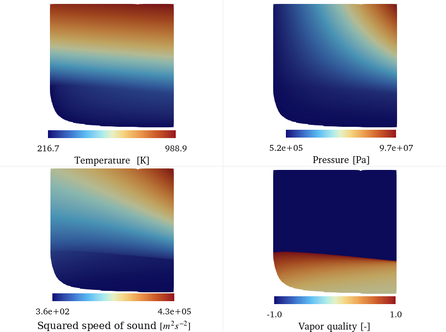
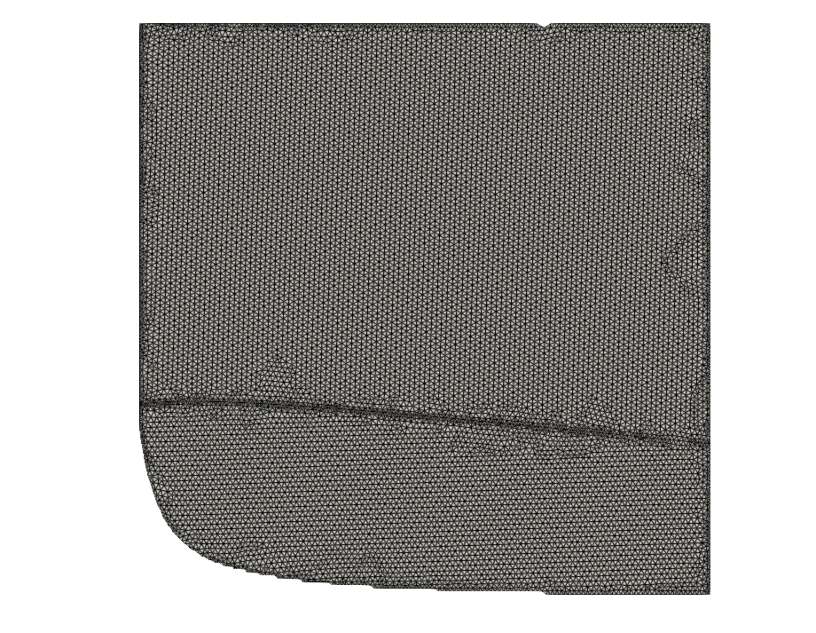
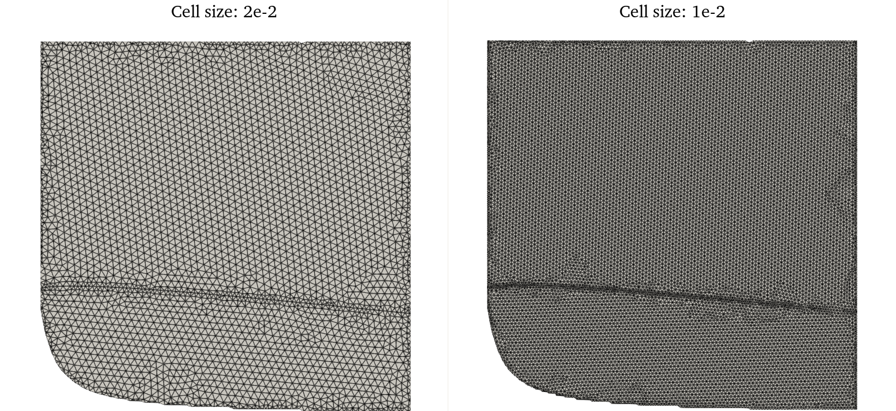
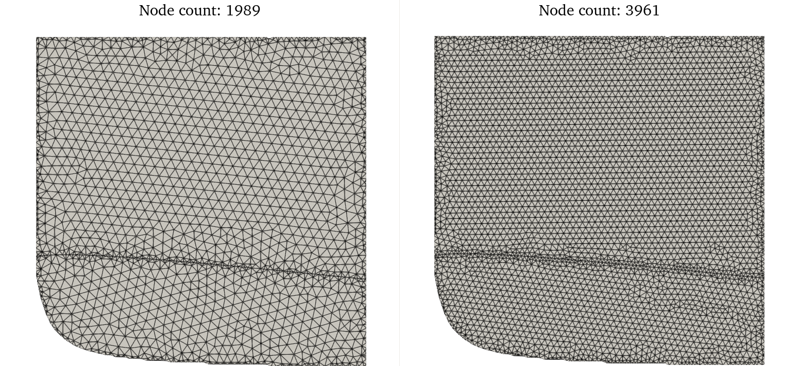
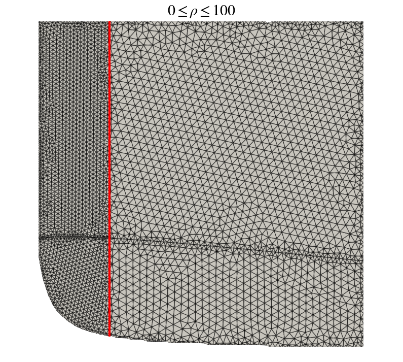
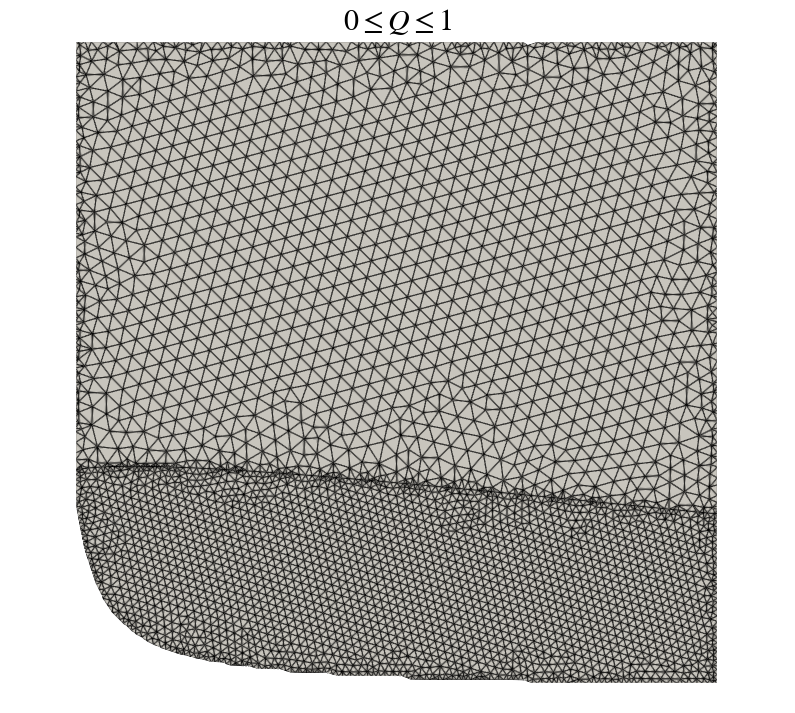
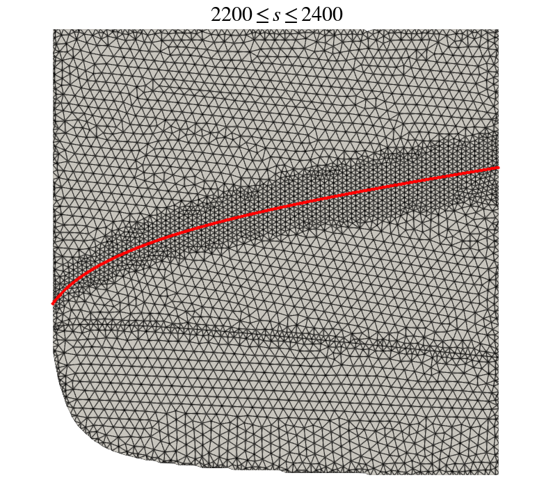
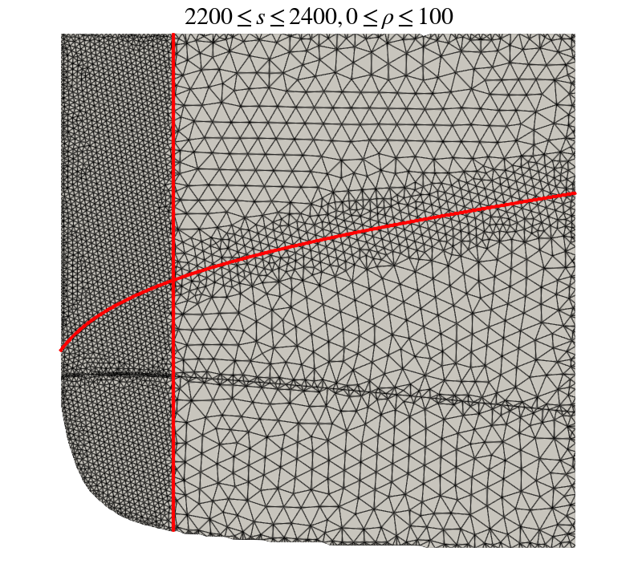
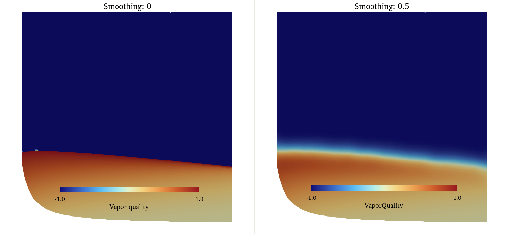

.. _NICFD_LUT: 

.. sectionauthor:: Evert Bunschoten

Table Generation for NICFD Applications 
=======================================

SU2 DataMiner supports the creation of look-up table methods for thermophyscial state evaluations in NICFD simulations in SU2. 
This tutorial showcases some of the functionalities for generating thermophyisical tables for NICFD applications in SU2. 

To get started, you will need to have installed SU2 DataMiner according to the :ref:`installation instructions <label_setup>`. 

.. contents:: :depth: 2

.. important::

    This tutorial was written for use on Linux systems. On Windows, make sure you replace the file path separator with a back-slash.

1. Config Generation
--------------------

As for any process within the SU2 DataMiner workflow, all settings regarding the setup of the fluid data generation and tabulation are stored in an SU2 DataMiner :ref:`configuration object <NICFD>`.
The tutorial for setting up a generic SU2 DataMiner configuration can be found :ref:`here <tutorialconfigs>`. 

In this example, a look-up table will be created for the application of modeling fluid properties of **carbondioxide** in **two-phase**, **super-critical** conditions.
The **Helmholtz equation of state** model is used to calculate thermodynamic properties of carbon dioxide throughout the thermodynamic state space with the density ranging between 0.2 and 400 kg/m3 and the static energy ranging between 1000 and 1e6 J/kg.

The following Python code snippet shows the initial set-up of the configuration object.

.. code-block::

    #!/usr/bin/env python3
    from su2dataminer.config import Config_NICFD 

    config = Config_NICFD()

    # Specify fluid and equation of state model.
    config.SetFluid("CarbonDioxide")
    config.SetEquationOfState("HEOS")

    config.IncludeTransportProperties(True)
    config.UseAutoRange(False)
    config.SetNpDensity(200)
    config.SetNpEnergy(200)
    config.SetDensityBounds(2.0, 400)
    config.SetEnergyBounds(1000, 1e6)
    
    # Enable gas, liquid, two-phase, and supercritical phases.
    config.EnableGasPhase(True)
    config.EnableLiquidPhase(True)
    config.EnableTwophase(True)
    config.EnableSuperCritical(True)

    # Export configuration.
    config.SetConfigName("tabulation_carbondioxide")
    config.SaveConfig()
    config.PrintBanner()

Running this code snippet will display all relevant information of the configuration in the terminal and will save the configuration as a 
binary file titled "tabulation_carbondioxide.cfg". 

2. Tabulation Example 
---------------------

Thermodynamic tables can be created with the :ref:`SU2TableGenerator_NICFD <doc_nicfd_tabulation>` class which is initiated with the SU2 DataMiner configuration object.
The following code snippet shows how to initiate the table generator and generate a basic look-up table for two-phase applications.
Running this code snippet produces **two table files**. The "LUTtest.vtk" can be loaded into **ParaView** to visually inspect the table contents. 
The "LUT_test.drg" file is the table file which can be loaded into **SU2** for NICFD simulations.

.. code-block::

    #!/usr/bin/env python3
    from su2dataminer.config import Config_NICFD 
    from su2dataminer.manifold import SU2TableGenerator_NICFD

    config = Config_NICFD("tabulation_carbondioxide.cfg")
    config.EnableTwophase(True)

    tgen = SU2TableGenerator_NICFD(config)
    tgen.setNNearestNeighbors(19)
    tgen.setInverseDistanceExponent(2)
    tgen.setMaximumCellSize(1e-2)
    tgen.setVerbosity(2)
    tgen.generateTable()
    tgen.writeSU2Table("LUT_test")
    tgen.writeParaviewTable("LUTtest")

You can **inspect** the table content by loading the vtk file in ParaView with the x- and y-dimensions corresponding to the **scaled density and static energy**.

   Temperature, pressure, and speed of sound of the look-up table generated with the previous code snippet.

The figure below shows the connectivity of the table nodes. All tables generated with *SU2 DataMiner* use **triangular cells** to connect the table nodes.
The topology of the cells **around the saturation curve** is modified for tables with two-phase fluid data. Consult the :ref:`NICFD table generation documentation page <doc_nicfd_tabulation>` for details.

   Cell topology of the example table.

3. Changing table limits 
------------------------

The table limits are determined based on the settings in the loaded configuration. Therefore, in order to generate two tables with different limits, the table generator needs to be re-initialized from the configuration with adjusted table limits.

.. code-block::

    config = Config_NICFD("tabulation_carbondioxide.cfg")
    config.SetDensityBounds(2.0, 400)
    config.SetEnergyBounds(1000, 1e6)

    tgen = SU2TableGenerator_NICFD(config)
    
    tgen.generateTable()
    tgen.writeParaviewTable("LUT_small")

    config.SetEnergyBounds(1000, 2e6)
    tgen = SU2TableGenerator_NICFD(config)
    tgen.generateTable()
    tgen.writeParaviewTable("LUT_large")

.. figure:: small_large_table.png
   :scale: 50 %
   :alt: 

   Temperature field of look-up table with energy range between 1e3 and 1e6 J/kg (left) and with energy range between 1e3 and 2e6 J/kg (right).

4. Table resolution and refinement 
----------------------------------

The thermodynamic state space is discretized by 2D elements with constant size by default. The cell size can be specified manually or determined automatically based on a target number of nodes.
For more information on the specific methods, go to the :ref:`documentation page for table refinement settings <doc_nicfd_tabulation_refinement>`.
The following code snippet shows how to generate two thermodynamic tables with the maximum cell size manually specified.

.. code-block::

    #!/usr/bin/env python3
    from su2dataminer.config import Config_NICFD 
    from su2dataminer.manifold import SU2TableGenerator_NICFD

    config = Config_NICFD("tabulation_carbondioxide.cfg")

    tgen = SU2TableGenerator_NICFD(config)
    tgen.setMaximumCellSize(2e-2)
    tgen.generateTable()
    tgen.writeParaviewTable("LUT_coarse")

    tgen.setMaximumCellSize(1e-2)
    tgen.generateTable()
    tgen.writeParaviewTable("LUT_fine")

   Look-up table with lower resolution (left) and higher resolution (right)

For better control of the runtime memory requirement of the table, it is also possible to generate a table with a specified approximate number of nodes.
Using this approach, the table generator will iterate the maximum cell size until the number of nodes in the table lies within 1% of the target.
The following code snippet shows how to generate tables with a specified target number of nodes. By setting the verbosity level to 2, the convergence history is printed in the terminal.

.. code-block::

    #!/usr/bin/env python3
    from su2dataminer.config import Config_NICFD 
    from su2dataminer.manifold import SU2TableGenerator_NICFD

    config = Config_NICFD("tabulation_carbondioxide.cfg")

    tgen = SU2TableGenerator_NICFD(config)
    tgen.setVerbosity(2)
    tgen.setTargetNodeCount(2000)
    tgen.generateTable()
    tgen.writeParaviewTable("LUT_coarse_n")

    tgen.setTargetNodeCount(4000)
    tgen.generateTable()
    tgen.writeParaviewTable("LUT_fine_n")

   Look-up table with lower resolution (left) and higher resolution (right)

The *SU2 DataMiner* table generator supports the use of adaptive local refinement based on thermodynamic quantities.
The user can specify a thermodynamic quantity, the bounds **within** which refinement is applied, and the **refinement factor** applied to the affected area of the table.
The refined cell size is equal to the product of the refinement factor and the maximum cell size. 
The following code snippet shows the command used to double the mesh resolution in the area of the table where the density lies between 0 and 100 kg/m3.

.. code-block::

    tgen.applyRefinementWithin("Density", 0, 100.0, 0.5)

Keep in mind that applying local refinement notably increases the time it takes to generate the table, especially when iterating to reach a target number of nodes.
The figure below shows the edges of a thermodynamic table with 4000 nodes with the density refinement criterion applied, alongside the contour of density equal to 100 kg/m3.

   Example of adaptive table refinement based on density criteria.

Local adaptive refinement applies to all thermophysical state quantities calculated by the NICFD data generator. For two-phase problems, it is therefore also possible to apply additional refinement in only the two-phase region, demonstrated by the following code snippet.
The refinement factor value does not need to be specified; the default value is set to 0.5.

.. code-block::

    tgen.applyRefinementWithin("VaporQuality", 0.0, 1.0)

   Adaptive table refinement in the two-phase region.

For fluid simulations of nearly isentropic flows, an effective method for improving the efficiency of the table is to apply refinement around an isentrope. 
The following code snippet demonstrates how to apply refinement around a specific isentrope in the table. 

.. code-block::

    isentrope = 2300
    tgen.applyRefinementWithin("s", isentrope-100.0, isentrope+100.0)

   Example of adaptive table refinement around an isentrope.

Finally, multiple local adaptive refinement criteria with different settings can be applied simultaneously.
In the following code snippet, refinement is applied around the isentrope and in the low-density region of the table. 
The order in which these refinement criteria is specified does not affect the outcome; the local cell size is determined based on the criterion with the lowest refinement factor.

.. code-block::

    isentrope = 2300
    tgen.applyRefinementWithin("s", isentrope-100.0, isentrope+100.0, 0.5)
    tgen.applyRefinementWithin("Density", 0, 100, 0.3)

   Example of adaptive table refinement based on multiple criteria.

5. Table quantities 
-------------------

The size of the look-up table depends on the number of nodes in the table and the number of thermophyscial variables. 
By default, all thermophyscial quantities are included. However, the number of variables can be reduced by manually defining 
the variables which will be included in the table. 

Density and static energy are always included in the list. If the generation of transport data is disabled in the configuration, conductivity, viscosity, and vapor quality are ignored.

.. code-block::

    tgen.setTableVars(["Density","Energy", "c2", "T", "p"])

6. Table data smoothing
-----------------------

Several thermodynamic quantities are discontinuous accross the saturation curve. Although this is a physical process, it may cause convergence problems when running NICFD simulations, especially when initializing the flow field. 
To improve the robustness of NICFD simulations, it helps to smoothen the table data. This will smoothen the transition between two-phase and single-phase fluid properties accross the saturation curve, making it easier for the flow solver to handle phenomena such as vaprisation onset and condensation.
The level of table smoothing can be specified through the **smoothing parameter**, demonstrated by the command in the following code snippet.

.. code-block:: 

    tgen.setSmoothingParameter(0.5)

Increasing the value of the smoothing parameter increases the amount of smoothing applied to the table data, but will also decrease the accuracy of the thermodynamic data in the table. For more details on the table smoothing method, consult the :ref:`documentation page <doc_nicfd_tabulation_refinement>`. for table generation.

   Tabulated vapor quality without smoothing (left) and with a smoothing factor of 0.5 (right).