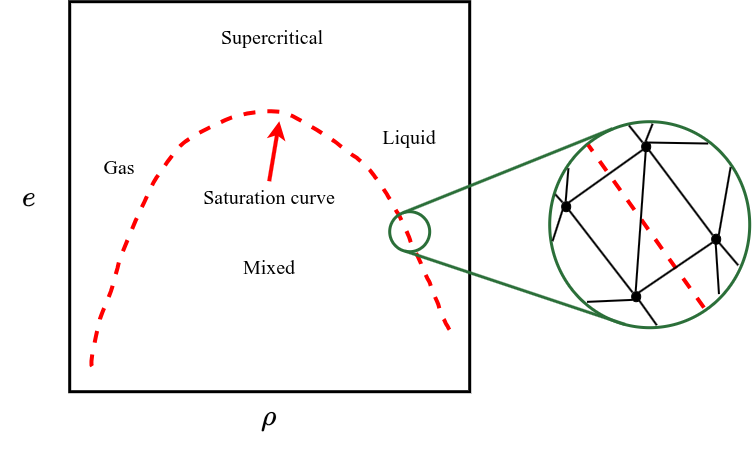

.. _doc_nicfd_tabulation:

.. sectionauthor:: Evert Bunschoten 

Tabulation methods for NICFD applications 
=========================================

This page documents the tabulation methods for NICFD applications in *SU2 DataMiner*. The NICFD table generator class is derived from the :ref:`base table generator class <doc_tablegeneration_base>` from which it inherets most of its functionalities.
NICFD tables are currently limited to 2D, and are generated in the **density-static energy** space. The main difference of the NICFD table generator with the base class is how the table space is discretized around the saturation curve for two-phase applications. More information about this can be found :ref:`here <doc_nicfd_tabulation_sat_curve>`.
Another difference with the base class is that the thermodynamic data in the finalized table are determined by **directly accessing the reference model** instead of interpolating the data from the initial point cloud. This way, the data in the table are not subject to interpolation errors. More information about this can be found :ref:`in this section <doc_nicfd_tabulation_fluid_data>`.

A tutorial which demonstrates the functionalities of the NICFD table generator can be found :ref:`here <NICFD_LUT>`.

.. contents:: :depth: 2

The limits of the table and two-phase application are retrieved from the *SU2 DataMiner* configuration upon initialization.

.. autofunction:: Manifold_Generation.LUT.LUTGenerators.SU2TableGenerator_NICFD.__init__ 

.. _doc_nicfd_tabulation_sat_curve: 

Table discretization around the saturation curve 
------------------------------------------------

It is challenging to accurately evaluate thermodynamic state properties exactly on the saturation curve. To improve the quality of two-phase tables, the table nodes around the saturation curve are placed at an offset with respect to the saturation curve. 
The local table structure around the saturation curve is illustrated below.

   Illustration of the table discretization around the saturation curve. The left side shows the saturation curve in the thermodynamic state space as the red, dashed line. The highlight box shows the table nodes (black dots) and edges (black lines) around the saturation curve.

By enclosing the saturation curve with the table nodes, it is ensured that no table nodes are placed exactly on the saturation curve, thereby avoiding any issues with interpolating the thermodynamic state data. 
Thermodynamic state data is linearly interpolated between the table nodes. By using this table structure, it is therefore ensured that the thermodynamic state changes linearly during phase transition. The offset of the table nodes with respect to the saturation curve is very small, thereby approximating the discontinuity. 

.. _doc_nicfd_tabulation_fluid_data:

Retrieving thermodynamic state data on the table nodes 
------------------------------------------------------

The :ref:`base table generator class <doc_tablegeneration_base>` evaluates the thermochemical state properties at the table nodes using inverse-distance-weighted interpolation. For NICFD applications, the :ref:`reference thermodynamic model <nicfddata>` is evaluated instead to improve accuracy. 
This makes the NICFD table generator considerably slower than the base class, depending on the equation of state model, but also more accurate as it introduces no additional interpolation errors. 

