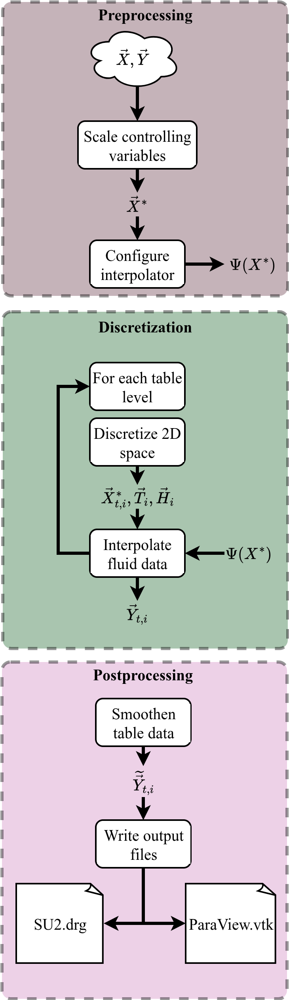
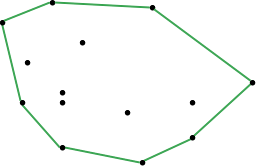
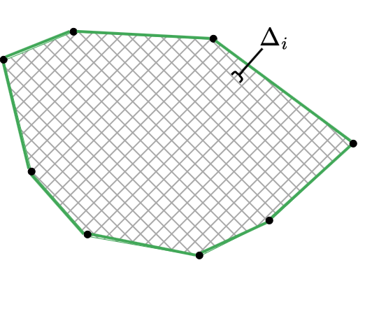

.. _doc_tablegeneration_base:

.. sectionauthor:: Evert Bunschoten 

Table Generator Base Class
==========================

This page documents the methods of the base table generator class used by *SU2 DataMiner*. 
Currently, *SU2 DataMiner* supports the generation of tables for :ref:`NICFD <doc_nicfd_tabulation>` and :ref:`FGM <doc_fgm_tabulation>` applications with two or three dimensions. 

The table generation process differs slightly between applications, but the general process is the same and is outlined :ref:`here <tablegeneralprocess>`. 
The 2D thermodynamic state space is discretized by triagular cells and 3D tables consist of 2D tables stacked in the third dimension. 
Details regarding the 2D discretization process can be found in :ref:`this section <2dtabulation>`, while information regarding the discretization in the third dimension can be found :ref:`here<3dtabulation>`.
Thermodynamic data is stored onto the nodes of the table by **interpolating** data from a point cloud of reference data. Details regarding the interpolation algorithm are provided in :ref:`this section<fluiddatainterp>`.
The resolution of the table greatly affects the accuracy and size of the table. The methods that can be used to control the resolution and size of the table are discussed :ref:`here<2dtabulation>`.
The :ref:`final section<outputformat>` of this page discusses the file formats supported by the table generator. 

.. contents:: :depth: 2

.. _tablegeneralprocess: 

General process 
---------------

The table generator is initiated from the settings listed in the *SU2 DataMiner* configuration.
The **number of table dimensions** is automatically set to the **number of controlling variables** listed in the configuration.

.. autofunction:: Manifold_Generation.LUT.LUTGenerator_Base.SU2TableGenerator_Base.__init__

After specifying all settings related to the resolution and content of the table, the tabulation process is initated with 

.. autofunction:: Manifold_Generation.LUT.LUTGenerator_Base.SU2TableGenerator_Base.generateTable

    
The tabulation process consists of three main steps which are visualized in the :ref:`figure below<fig_general_process>`.
During **preprocessing**, the cloud of fluid data generated by the data generation process in the *SU2 DataMiner* workflow is used to configure an interpolation function.
The fluid data point cloud spans the **controlling variable state space**, according to the controlling variables specified in the *SU2 DataMiner* configuration object.
Each sample in the point cloud is assigned unique values for the controlling variables :math:`X` and the thermodynamic, thermophysical, or thermochemical state :math:`Y`.

The data for the controlling variables are linearly scaled between 0 and 1 before configuring the interpolation algorithm. 
The interpolation algorithm interpolates fluid data from the nearest neighbor(s) in the scaled controlling variable state space :math:`\vec{X}^*`. 
There are several parameters which affect the accuracy of the interpolation algorithm and the optimal values are problem dependent. More details regarding the interpolation algorithm and the calibration process can be found in :ref:`this section<fluiddatainterp>`
Once the interpolator :math:`\Psi` has been calibrated, the thermodynamic state space can be discretized.

The thermodynamic state space is discretized by creating 2D tables that span the first two controlling variables and stack those in the third dimension. 
Only one 2D table will be generated when only two controlling variables are considered. 
For each 2D table, the thermodynamic state space is discretized using a method based around `Gmesh <https://gmsh.info>`_. 
Here, each 2D table is discretized according to the :ref:`refinement settings<2dtabulation>` specified by the user. 
After disretizing the 2D space, the fluid data are interpolated onto the table nodes using the :ref:`fluid data interpolation algorithm<fluiddatainterp>`.
The computational time required to generate 3D tables can be significantly reduced with parallel processing. More information on this can be found in :ref:`this section<3dtabulation>`.

After discretizing each table level and interpolating the fluid data, the table information is written to output files.
By default, the table generator will write the table content in *drg* format which allows the table to be loaded into SU2 for data-driven fluid simulations.
In addition, the table can be written in *vtk* format, which allows the table content to be inspected using post-processing software like *ParaView*. 
More information on the table file format and on how to write the table to *vtk* can be found in :ref:`this section<outputformat>`.

.. _fig_general_process:

   Diagram of the process used for table generation

The thermochemical state variables for which data is included in the finalized table can be specified with 

.. autofunction:: Manifold_Generation.LUT.LUTGenerator_Base.SU2TableGenerator_Base.setTableVars 

.. _fluiddatainterp: 

Fluid data interpolation
------------------------

For not all problems is it possible to directly evaluate the thermodynamic state properties on the table nodes using a reference model. 
Instead, fluid data are interpolated from a cloud of data points generated using the reference model. 
The interpolation algorithm used for table generation in *SU2 DataMiner* is **inverse distance-weighted, nearest-neighbor interpolation**.

The interpolated fluid data :math:`\widetilde{Y}` evaluated at query location :math:`X^*` is calculated using 

.. math::

    \widetilde{Y}(X^*) = \frac{\sum_{i=0}^{N_n} w_i(X^*)Y_i}{\sum_{i=0}^{N_n}w_i(X^*)},

where :math:`N_n` is the number of **nearest neighbors**, :math:`w_i` the coefficient applied to the respective node in the point cloud which stores thermodynamic data :math:`Y_i`.
The coeffcient :math:`w_i` is calculated with 

.. math::

    w_i(X^*) = \left(X^* - X_i^*\right)^{-d},

where :math:`d` is the **inverse distance exponent**, and :math:`X_i^*` the scaled controlling variables of point cloud node :math:`i`.
The control variables of the nearest neighbors :math:`X_i^*` are determined using the `KD tree algorithm from Scipy <https://docs.scipy.org/doc/scipy/reference/generated/scipy.spatial.cKDTree.html>`_.

The values of :math:`N_n` and :math:`d` can significantly affect the accuracy and quality of the interpolated fluid data in the table.
Setting a high value for :math:`N_n` and a low value for :math:`d` will have a **smoothing** effect on the interpolated fluid data, which can be useful for sparse point clouds.
However, it will also **reduce accuracy**, especially near the edges of the table. 

The number of nearest neighbors and the inverse distance parameter can be specified by the user with the following functions.

.. autofunction:: Manifold_Generation.LUT.LUTGenerator_Base.SU2TableGenerator_Base.setNNearestNeighbors

.. autofunction:: Manifold_Generation.LUT.LUTGenerator_Base.SU2TableGenerator_Base.setInverseDistanceExponent

If :math:`N_n` and :math:`d` are not manually specified, their optimum values will be automatically determined through a **brute force search**. 

.. _2dtabulation: 

2D tabulation
-------------

Two-dimensional tables are generated by discretizing the 2D space enclosed by an initial point cloud. The python classes which handles the 2D discretization can be found under **Manifold_Generation->LUT->MeshTools.py**.
The process by which 2D tables are generated is as follows:

1. **Create perimiter from point cloud of normalized coordinates.** From a cloud of points with 3D planar coordinates of the scaled controlling variables, the nodes of the enclosed perimiter are selected using the `concave hull module <https://concave-hull.readthedocs.io/en/latest/>`_.

   Initial point cloud.

   Perimiter of the planar points. The enclosed space is discretized by the table generator.

2. **Discretize the 2D space.** The surface enclosed by the perimiter is discretized using **triangular cells** based on user-defined refinement criteria. The minimum resolution of the 2D table is determined by either manually specifying the maximum cell size with

.. autofunction:: Manifold_Generation.LUT.LUTGenerator_Base.SU2TableGenerator_Base.setMaximumCellSize

or by specifying the approximate number of nodes in the table with 

.. autofunction:: Manifold_Generation.LUT.LUTGenerator_Base.SU2TableGenerator_Base.setTargetNodeCount

The maximum cell size :math:`\Delta` is determined through an iterative process

.. math:: 
    
    \Delta_{i+1} = \Delta_{i} * (1 + f_r)\left(\frac{N_i}{N_t}-1\right),

where :math:`f_r` is a relaxation factor set to 0.35, :math:`N_i` is the number of nodes in the 2D domain discretized with cells of size :math:`\Delta_i`, and :math:`N_t` is the target number of nodes.
The initial value of :math:`\Delta` is approximated with 

.. math::

    \Delta_0 = 2\sqrt{A_P / N_t}

where :math:`A_P` is the area enclosed by the perimiter. 

The process terminates when :math:`N` is within 1% of :math:`N_t`.

   Illustration of the 2D space discretized by uniformly sized cells.

Additional, local refinement in the 2D space can be applied based on the thermochemical state variables interpolated onto the 2D grid using the following function.

.. autofunction:: Manifold_Generation.LUT.LUTGenerator_Base.SU2TableGenerator_Base.applyRefinementWithin

When user-defined refinement criteria are defined, the cell size :math:`\Delta` at the node coordinates :math:`X^*` is determined by 

.. math::

    \Delta(X^*) = \Delta * r(X^*),

where :math:`r(X^*)` is the local refinement factor defined as 

.. math::

    r(X^*) = \min_j\left(r_j(X^*)\right),

in which :math:`r_j(X^*)` is the value user-defined refinement factor for thermochemical state variable :math:`j`.

The value of :math:`r_j(X^*)` is evaluated with 

.. math::

    r_j(X^*) = f_j\left(H(\Psi_j(X^*) - \mathrm{lb}_j) - H(\Psi_j(X^*) - \mathrm{ub}_j)\right),

in which :math:`\Psi_j(X^*)` is the interpolated value of thermochemical state variable :math:`j` and :math:`\mathrm{lb}_j` and :math:`\mathrm{ub}_j` the lower and upper bounds specified in the aforementioned function.

For example, the following code snippet would result in a table with double the mesh resolution in the area of the table where the interpolated temperature lies between 300 and 500 Kelvin. 

.. code-block::

    SU2TableGenerator_Base.applyRefinementWithin(varname="Temperature", lowerbound=300, upperbound=500, coef=0.5)

3. **Retrieve mesh node information.** The thermochemical state data are interpolated onto the scaled table node coordinates :math:`\vec{X}^*_t` and the the node connectivity information :math:`\vec{T}` and the indices of the table nodes along the perimiter :math:`\vec{H}` are retrieved for post-processing.

4. **Table data smoothing.** The optional final step is to smoothen the thermochemical data interpolated onto the table nodes. This is done by applying radial basis function (RBF) interpolation to the data of the table nodes. `The RBF interpolator from Scipy <https://docs.scipy.org/doc/scipy/reference/generated/scipy.interpolate.RBFInterpolator.html>`_ with a linear kernel is used for this application.
The level of smoothing can be specified with the following function. 

.. autofunction:: Manifold_Generation.LUT.LUTGenerator_Base.SU2TableGenerator_Base.setSmoothingParameter

The higher the value of the smoothening parameter, the more smoothing is applied to the table level data, while a value of 0 results in no additional smoothing being applied. 

.. _3dtabulation: 

3D tabulation 
-------------

Currently, *SU2 DataMiner* supports only one format of 3D tables; that of 2D tables stacked in the third dimension. The coordinates of the third dimension, or *table levels*, for which 2D tables are generated, can be defined through the following functions. 

By default, the table levels are linearly spaced between user-defined limits specified with 

.. autofunction:: Manifold_Generation.LUT.LUTGenerator_Base.SU2TableGenerator_Base.setTableLimits

and the number of levels is defined with 

.. autofunction:: Manifold_Generation.LUT.LUTGenerator_Base.SU2TableGenerator_Base.setNTableLevels

It is also possible to insert a level at a specific value using 

.. autofunction:: Manifold_Generation.LUT.LUTGenerator_Base.SU2TableGenerator_Base.insertTableLevel

Alternatively, the user can manually specify the values of the table limits with 

.. autofunction:: Manifold_Generation.LUT.LUTGenerator_Base.SU2TableGenerator_Base.setTableLevels

The generation of the 2D tables along the third dimension can run in parallel to speed up the table generation process. The number of cores to be dedicated to this process can be specified with

.. autofunction:: Manifold_Generation.LUT.LUTGenerator_Base.SU2TableGenerator_Base.setNProcessors

.. _outputformat: 

Table output file format 
------------------------

After completing the nodes are calculated and the thermochemical state data are interpolated and smoothened, the table information can be exported into files. Currently, *SU2 DataMiner* tables can be written to *vtk* and *drg* format.
To export the table in *vtk*, the following function should be used 

.. autofunction:: Manifold_Generation.LUT.LUTGenerator_Base.SU2TableGenerator_Base.writeParaviewTable

The connectivity information is extracted from the 2D discretizations in the table. Therefore, individual *vtk* files are written for each table level when generating 3D tables. 

Generating the table in *vtk* format is purely for visual inspection of the content of the table. To use the table in *SU2* fluid simulations, the table should be exported into *drg* using the following function. 

.. autofunction:: Manifold_Generation.LUT.LUTGenerator_Base.SU2TableGenerator_Base.writeSU2Table

The *drg* file is in ASCII format and contains all the information needed for *SU2* to interpolate thermochemical state information. 

